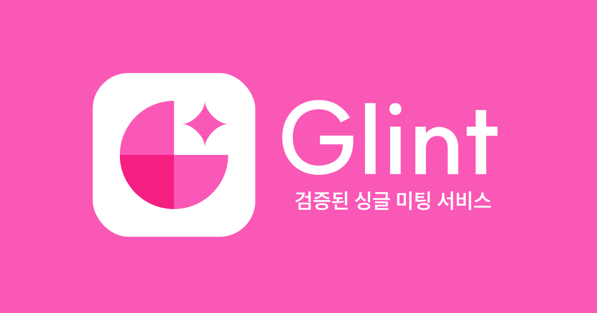

# ✨ Glint

<strong>'소개팅 앱은 있는데 왜 미팅 앱은 없는 거지?'</strong> 
라는 단순한 아이디어에서 시작 저희 서비스 ✨<strong>Glint</strong>✨는 2030 싱글남녀를 타깃으로 
자신과 비슷한 직군, 업계, 학교 등과 미팅을 할 수 있도록 연결해 주는 서비스입니다.

## 📍 개요

🩷 프로젝트 이름 : Glint 
🩷 프로젝트 기간 : 2024.06 ~ 진행중 
🩷 멤버 : FE - 이나래, 이현진 
🩷 배포 : [https://glint.swygbro.com/](https://glint.swygbro.com/)

## 🔖 목차

#### [1. 기술 스택](#기술-스택)

#### [2. 페이지 별 기능](#페이지-별-기능)

#### [3. 화면 구성](#-화면-구성)

#### [4. 트러블 슈팅](#트러블-슈팅)

#### [5. 멤버 소개](#멤버-소개)

### 🔧 기술 스택

&nbsp;
 &nbsp;
 &nbsp;
&nbsp;
&nbsp;
&nbsp;
&nbsp;
&nbsp;
&nbsp;

### 📖 페이지 별 기능

| PAGE           | FUNCTION                                                                                                                                                                                                                                                                                                                            |
| -------------- | ----------------------------------------------------------------------------------------------------------------------------------------------------------------------------------------------------------------------------------------------------------------------------------------------------------------------------------- |
| 🌟 LOGIN       | 랜딩페이지 / 소셜(카카오) 로그인                                                                                                                                                                                                                                                                                                    |
| 🌟 SIGNUP      | - **회원가입**   - 닉네임, 성별, 생년월일, 카, 프로필 사진 등록 순서로 회원가입 진행                                                                                                                                                                                                                                            |
| 🌟 MAIN        | - **새로 생긴 미팅방 조회**   - 미팅 방 생성 페이지로 이동  - 키워드 클릭 시 검색 페이지로 이동  구현 중: 미팅 검색 필터 / 알람 기능                                                                                                                                                                                |
| 🌟 CREATE ROOM | - **미팅 방 생성**   - 미팅 희망 지역, 이성, 동성에 따라 참가조건 선택(회사/학교 검색, 나이, 키, 종교, 흡연 여부, 음주 여부)하여 미팅 방 생성    구현 중 : 회사/학교 검색하여 등록                                                                                                                                      |
| 🌟 MY MEETING  | - **참가, 대기 미팅 조회 탭**   - 참가신청을 누르고 수락이 된 참가 미팅 탭  - 참가 신청을 누르고 대기 중인 대기 미팅 탭                                                                                                                                                                                                     |
| 🌟 MEETING     | - **미팅 정보를 확인하고 참가 신청을 할 수 있는 홈 탭**   - 미팅 방을 만든 방장인 경우 참가 신청인을 확인하고 수락 및 거절할 수 있는 신청 목록 탭  - 참가 수락이 된 경우 채팅 방 사람들과 채팅 할 수 있는 채팅 탭  구현 중: 채팅 방 공유하기                                                                        |
| 🌟 SEARCH      | - 인기 검색어 / 최근 검색어 / 키워드 검색 시 해당되는 **미팅방 검색**  - 미팅 희망 지역 필터  구현 중: 미팅 키워드 필터                                                                                                                                                                                                 |
| 🌟 MY INFO     | - **내 정보 수정 및 조회**   - 간단한 내 정보(이미지, 닉네임, 나이, 지역, 직장/학교), 이미지 변경  - 내 프로필 페이지 이동  - 로그아웃  - 회원 탈퇴  구현 중: 인증 관리 페이지 이동 / 친구 관리 페이지 이동 / 같은 학교, 직장 차단, 연락처로 지인 차단, 채팅 알림 사용, 초대 알림 사용, 참가 신청 알림 사용 |
| 🌟 MY PROFILE  | - 지역, 키, 종교, 흡연, 음주 및 **자기소개 작성**   구현 중: 회사/학교 인증                                                                                                                                                                                                                                                 |

### 💻 화면 구성

### 🔑 트러블 슈팅

### 💛 멤버 소개

|        |                MEMBER                 |               MEMBER                |
| ------ | :-----------------------------------: | :---------------------------------: |
| NAME   |                이나래                 |               이현진                |
| GITHUB | [narae](https://github.com/dlskfo306) | [zinnli](https://github.com/zinnli) |
